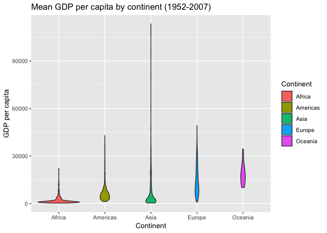
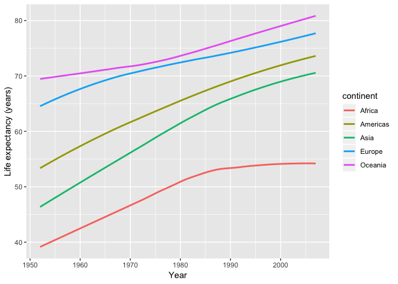

Homework3CarolineSeip
================
Caroline
September 27, 2018

Table of contents
=================

-Introduction -Loading packages -Task 1: Get the maximum and minimum of GDP per capita for all continents -Task 2 -Task 3 -But I want to do more!

First let's load the dataset, tidyverse and knitr

``` r
#Load gapminder dataset
library(gapminder)
#Load tidyverse to use dplyr and ggplot
library(tidyverse)
```

    ## ── Attaching packages ─────────────────────────────────────────── tidyverse 1.2.1 ──

    ## ✔ ggplot2 3.0.0     ✔ purrr   0.2.5
    ## ✔ tibble  1.4.2     ✔ dplyr   0.7.6
    ## ✔ tidyr   0.8.1     ✔ stringr 1.3.1
    ## ✔ readr   1.1.1     ✔ forcats 0.3.0

    ## ── Conflicts ────────────────────────────────────────────── tidyverse_conflicts() ──
    ## ✖ dplyr::filter() masks stats::filter()
    ## ✖ dplyr::lag()    masks stats::lag()

``` r
#Load knitr to use the kable function
library(knitr)
```

Task 1: Get the maximum and minimum of GDP per capita for all continents
========================================================================

``` r
a <- gapminder %>% 
  group_by(continent) %>%
  mutate_each(funs(round(.,2)), gdpPercap) %>% 
  summarize(min=min(gdpPercap),
            max=max(gdpPercap))
```

    ## `mutate_each()` is deprecated.
    ## Use `mutate_all()`, `mutate_at()` or `mutate_if()` instead.
    ## To map `funs` over a selection of variables, use `mutate_at()`

``` r
a %>% 
kable(col.names = c("Continent", "Minimum GDP per capita", "Maximum GDP per capita"))
```

| Continent |  Minimum GDP per capita|  Maximum GDP per capita|
|:----------|-----------------------:|-----------------------:|
| Africa    |                  241.17|                21951.21|
| Americas  |                 1201.64|                42951.65|
| Asia      |                  331.00|               113523.13|
| Europe    |                  973.53|                49357.19|
| Oceania   |                10039.60|                34435.37|

Hmm let's do a check to make sure that went right... let's look at the minimum GDP per capita for Oceania

``` r
gapminder %>% 
  #Filter to only see Oceania data
  filter(continent == "Oceania") %>% 
  #Arrange by gdpPercap so that we can see the minimum first
  arrange(gdpPercap)
```

    ## # A tibble: 24 x 6
    ##    country     continent  year lifeExp      pop gdpPercap
    ##    <fct>       <fct>     <int>   <dbl>    <int>     <dbl>
    ##  1 Australia   Oceania    1952    69.1  8691212    10040.
    ##  2 New Zealand Oceania    1952    69.4  1994794    10557.
    ##  3 Australia   Oceania    1957    70.3  9712569    10950.
    ##  4 Australia   Oceania    1962    70.9 10794968    12217.
    ##  5 New Zealand Oceania    1957    70.3  2229407    12247.
    ##  6 New Zealand Oceania    1962    71.2  2488550    13176.
    ##  7 New Zealand Oceania    1967    71.5  2728150    14464.
    ##  8 Australia   Oceania    1967    71.1 11872264    14526.
    ##  9 New Zealand Oceania    1972    71.9  2929100    16046.
    ## 10 New Zealand Oceania    1977    72.2  3164900    16234.
    ## # ... with 14 more rows

Yay it's right!

Let's do a visual check by making a box plot to see the minimum and maximum values of GDP per capita by continent:

``` r
  #Use ggplot, specify your dataset and aesthetics(x,y)
ggplot(gapminder, aes(continent, gdpPercap)) +
  #Add a boxplot
  geom_boxplot(aes(fill=continent)) +
  #Label the axes
  xlab("Continent") +
  ylab("GDP per capita") +
  guides(fill=guide_legend(title= "Continent"))
```



Task 2: How is life expectancy changing over time on different continents?
==========================================================================

``` r
gapminder %>%
mean(lifeExp)
```

    ## Warning in mean.default(., lifeExp): argument is not numeric or logical:
    ## returning NA

    ## [1] NA

``` r
gapminder %>% 
  filter(year == "1952"| year == "2007") %>% 
   select(continent, year, lifeExp) %>% 
  group_by(continent, year) %>% 
  summarize(life = mean(lifeExp))
```

    ## # A tibble: 10 x 3
    ## # Groups:   continent [?]
    ##    continent  year  life
    ##    <fct>     <int> <dbl>
    ##  1 Africa     1952  39.1
    ##  2 Africa     2007  54.8
    ##  3 Americas   1952  53.3
    ##  4 Americas   2007  73.6
    ##  5 Asia       1952  46.3
    ##  6 Asia       2007  70.7
    ##  7 Europe     1952  64.4
    ##  8 Europe     2007  77.6
    ##  9 Oceania    1952  69.3
    ## 10 Oceania    2007  80.7

``` r
gapminder %>%
  ggplot(aes(year, lifeExp)) +
  geom_smooth(se= FALSE, aes(colour= continent)) +
  xlab("Year") +
  ylab("Life expectancy (years)") +
  guides(fill=guide_legend(title= "Continent"))
```

    ## `geom_smooth()` using method = 'loess' and formula 'y ~ x'


