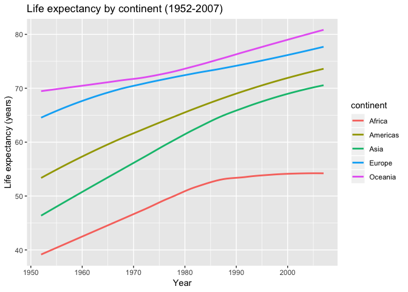
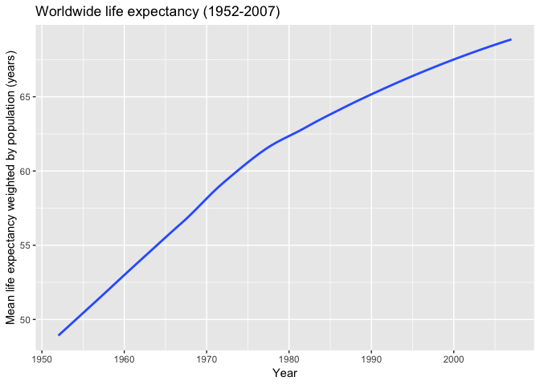

Homework3CarolineSeip
================
Caroline
September 27, 2018

Table of contents
=================

-   Introduction
-   Loading packages
-   Task 1: Get the maximum and minimum of GDP per capita for all continents
-   Task 2: How is life expectancy changing over time on different continents?
-   Task 3: Compute a weighted mean of life expectancy for different years

Introduction
============

In this document we will explore the gapminder dataset by creating tables and figures of the relationships between different variables in the dataset. In the first task, we will find the maximum and minimum values of GDP per capita for each continent, and visualize the spread of GDP per capita values for each continent. For task 2 we will view how life expectancy for each continent have changed over time, and visualize this change using a line graph. In the final task we will compute a weighted mean of life expectancy for each year of data collection, weighted by the population of each country. We will then visualize what this looks like using a line graph.

Loading packages
================

First let's load the dataset, tidyverse and knitr.

``` r
#Load gapminder dataset
library(gapminder)
#Load tidyverse to use dplyr and ggplot
library(tidyverse)
```

    ## ── Attaching packages ──────────────────────────────────────────── tidyverse 1.2.1 ──

    ## ✔ ggplot2 3.0.0     ✔ purrr   0.2.5
    ## ✔ tibble  1.4.2     ✔ dplyr   0.7.6
    ## ✔ tidyr   0.8.1     ✔ stringr 1.3.1
    ## ✔ readr   1.1.1     ✔ forcats 0.3.0

    ## ── Conflicts ─────────────────────────────────────────────── tidyverse_conflicts() ──
    ## ✖ dplyr::filter() masks stats::filter()
    ## ✖ dplyr::lag()    masks stats::lag()

``` r
#Load knitr to use the kable function
library(knitr)
```

Task 1: Get the maximum and minimum of GDP per capita for all continents
========================================================================

Let's make a table of the minimum and maximum values of GDP per capita for each continent.

``` r
#Use the gapminder dataset
a <- gapminder %>% 
  #Group by continent
  group_by(continent) %>%
  #Calculate the minimum and maximum GDP per capita for each continent
  summarize(min=min(gdpPercap),
            max=max(gdpPercap))
#Now put this into a table using the 'kable' function
a %>% 
kable(col.names = c("Continent", "Minimum GDP per capita", "Maximum GDP per capita"))
```

| Continent |  Minimum GDP per capita|  Maximum GDP per capita|
|:----------|-----------------------:|-----------------------:|
| Africa    |                241.1659|                21951.21|
| Americas  |               1201.6372|                42951.65|
| Asia      |                331.0000|               113523.13|
| Europe    |                973.5332|                49357.19|
| Oceania   |              10039.5956|                34435.37|

Ok, now let's do a check to make sure that went right... let's look at the minimum GDP per capita for Oceania as a check.

``` r
#Use the gapminder dataset
gapminder %>% 
  #Filter to only see Oceania data
  filter(continent == "Oceania") %>% 
  #Arrange by gdpPercap so that we can see the minimum first
  arrange(gdpPercap)
```

    ## # A tibble: 24 x 6
    ##    country     continent  year lifeExp      pop gdpPercap
    ##    <fct>       <fct>     <int>   <dbl>    <int>     <dbl>
    ##  1 Australia   Oceania    1952    69.1  8691212    10040.
    ##  2 New Zealand Oceania    1952    69.4  1994794    10557.
    ##  3 Australia   Oceania    1957    70.3  9712569    10950.
    ##  4 Australia   Oceania    1962    70.9 10794968    12217.
    ##  5 New Zealand Oceania    1957    70.3  2229407    12247.
    ##  6 New Zealand Oceania    1962    71.2  2488550    13176.
    ##  7 New Zealand Oceania    1967    71.5  2728150    14464.
    ##  8 Australia   Oceania    1967    71.1 11872264    14526.
    ##  9 New Zealand Oceania    1972    71.9  2929100    16046.
    ## 10 New Zealand Oceania    1977    72.2  3164900    16234.
    ## # ... with 14 more rows

Yay it's right! We can see the GDP per capita for Australia in 1952 is 10040, which matches up with the summarize function we used to find the minimum GDP per capita in Oceania.

Let's do a visual check by making a violin plot to see the minimum and maximum values of GDP per capita by continent:

``` r
  #Use ggplot, specify your dataset and aesthetics(x,y)
ggplot(gapminder, aes(continent, gdpPercap)) +
  #Add a boxplot
  geom_violin(aes(fill=continent)) +
  #Label the axes
  xlab("Continent") +
  ylab("GDP per capita") +
  #Change the legend title
  guides(fill=guide_legend(title= "Continent")) +
  #Add a title
  ggtitle("Mean GDP per capita by continent (1952-2007)")
```


Here we can see again that the minimum GDP per capita value for Oceania is around the 10,000 line. The violin plot gives us a good idea of the spread of our data, because we can see how much data is at each level of GDP per capita, unlike with a box plot.

Task 2: How is life expectancy changing over time on different continents?
==========================================================================

First let's make a table of life expectancy values averaged by continent for each year.

``` r
#Use the gapminder dataset
gapminder %>% 
  #Select the continent, year, and life expectancy variables
   select(continent, year, lifeExp) %>% 
  #Group by continent and year
  group_by(continent, year) %>% 
  #Find mean life expectancy for each continent, in each year
  summarize(life = mean(lifeExp)) %>% 
#Use kable to make a table
  kable(col.names = c("Continent", "Year", "Mean life expectancy"))
```

| Continent |  Year|  Mean life expectancy|
|:----------|-----:|---------------------:|
| Africa    |  1952|              39.13550|
| Africa    |  1957|              41.26635|
| Africa    |  1962|              43.31944|
| Africa    |  1967|              45.33454|
| Africa    |  1972|              47.45094|
| Africa    |  1977|              49.58042|
| Africa    |  1982|              51.59287|
| Africa    |  1987|              53.34479|
| Africa    |  1992|              53.62958|
| Africa    |  1997|              53.59827|
| Africa    |  2002|              53.32523|
| Africa    |  2007|              54.80604|
| Americas  |  1952|              53.27984|
| Americas  |  1957|              55.96028|
| Americas  |  1962|              58.39876|
| Americas  |  1967|              60.41092|
| Americas  |  1972|              62.39492|
| Americas  |  1977|              64.39156|
| Americas  |  1982|              66.22884|
| Americas  |  1987|              68.09072|
| Americas  |  1992|              69.56836|
| Americas  |  1997|              71.15048|
| Americas  |  2002|              72.42204|
| Americas  |  2007|              73.60812|
| Asia      |  1952|              46.31439|
| Asia      |  1957|              49.31854|
| Asia      |  1962|              51.56322|
| Asia      |  1967|              54.66364|
| Asia      |  1972|              57.31927|
| Asia      |  1977|              59.61056|
| Asia      |  1982|              62.61794|
| Asia      |  1987|              64.85118|
| Asia      |  1992|              66.53721|
| Asia      |  1997|              68.02052|
| Asia      |  2002|              69.23388|
| Asia      |  2007|              70.72848|
| Europe    |  1952|              64.40850|
| Europe    |  1957|              66.70307|
| Europe    |  1962|              68.53923|
| Europe    |  1967|              69.73760|
| Europe    |  1972|              70.77503|
| Europe    |  1977|              71.93777|
| Europe    |  1982|              72.80640|
| Europe    |  1987|              73.64217|
| Europe    |  1992|              74.44010|
| Europe    |  1997|              75.50517|
| Europe    |  2002|              76.70060|
| Europe    |  2007|              77.64860|
| Oceania   |  1952|              69.25500|
| Oceania   |  1957|              70.29500|
| Oceania   |  1962|              71.08500|
| Oceania   |  1967|              71.31000|
| Oceania   |  1972|              71.91000|
| Oceania   |  1977|              72.85500|
| Oceania   |  1982|              74.29000|
| Oceania   |  1987|              75.32000|
| Oceania   |  1992|              76.94500|
| Oceania   |  1997|              78.19000|
| Oceania   |  2002|              79.74000|
| Oceania   |  2007|              80.71950|

This table allows us to look at the exact value for any given year, but it is not great for visualizing the change in life expectancy over time. Let's make a line graph now so that we can visualize this change.

``` r
#Use the gapminder dataset
gapminder %>%
  #Indicate ggplot and set the x and y variables using aesthetics
  ggplot(aes(year, lifeExp)) +
  #Add a smooth line to the plot, turn off the standard error bars, and colour the lines by continent
  geom_smooth(se= FALSE, aes(colour= continent)) +
  #Add x and y labels, and a title
  xlab("Year") +
  ylab("Life expectancy (years)") +
  ggtitle("Life expectancy by continent (1952-2007)")
```

    ## `geom_smooth()` using method = 'loess' and formula 'y ~ x'



This graph shows the trend of life expectancy over time much better than the table of values does. We can see that life expectancies for all continents continually increased over time, but that Africa's life expectancy has levelled off since the 1980s at under 55 years old.

Task 3: Compute a weighted mean of life expectancy for different years
======================================================================

Let's start by calculating the weighted mean using the 'weighted.mean' function, and making a table of the values.

``` r
#Use the gapminder dataset
gapminder %>% 
  #Group by year
  group_by(year) %>% 
  #Compute a weighted mean of life expectancy, weighting by population
  summarize(wm=weighted.mean(lifeExp, pop)) %>% 

  #Create a table of the weighted life expectancy values
  kable(col.names = c("Year", "Mean life expectancy weighted by population (years)"))
```

|  Year|  Mean life expectancy weighted by population (years)|
|-----:|----------------------------------------------------:|
|  1952|                                             48.94424|
|  1957|                                             52.12189|
|  1962|                                             52.32438|
|  1967|                                             56.98431|
|  1972|                                             59.51478|
|  1977|                                             61.23726|
|  1982|                                             62.88176|
|  1987|                                             64.41635|
|  1992|                                             65.64590|
|  1997|                                             66.84934|
|  2002|                                             67.83904|
|  2007|                                             68.91909|

The weighted mean gives a better picture of the average worldwide life expectancy for each year, because it gives equal value to each person on the planet, rather than biasing the mean based on country.

Let's visualize the data using a line graph.

``` r
#Pipe the previous function into a ggplot
gapminder %>% 
  group_by(year) %>% 
  summarize(wm=weighted.mean(lifeExp, pop)) %>% 
  #Create a plot specifying the x and y aesthetics
  ggplot(aes(year, wm)) +
  #Add a smooth line, remove standard error bars
  geom_smooth(se=FALSE) +
  #Add x and y labels, and a title
  xlab("Year") +
  ylab("Mean life expectancy weighted by population (years)") +
  ggtitle("Worldwide life expectancy (1952-2007)")
```

    ## `geom_smooth()` using method = 'loess' and formula 'y ~ x'



Here we can see that worldwide life expectancy has been increasing since 1952. The trend has slightly levelled off since the 1970s, representing that there is a maximum life expectancy that is being approached.
